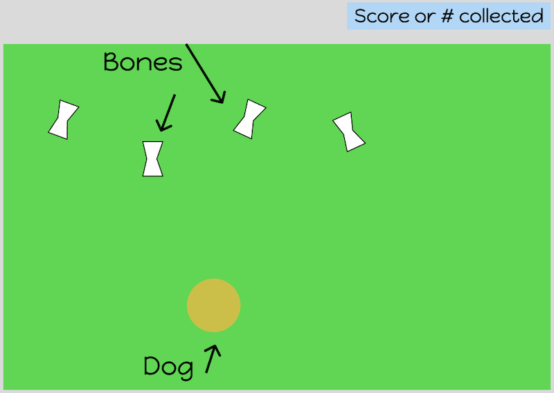

# Brady Bunch the Rescue's Boneyard
## About the Game 

Brady's favorite thing is a good bone. And he loves to run. Help Brady move to collect as many bones as he can. He also loves to find and chew on objects that aren't great for him. Help him stay away from those. 

## Tech Stack
- HTML - Possibly with use of Canvas
- CSS - I intend to incorporate Tailwind CSS where I can. 
- Javascript
## MVP
- Create background of a field.
- Create character of dog.
- Have random bones appear.
- Have random other objects/the obstacle appear.
- Allow user to move character with arrow keys around field. 
- Keep track of how many bones the dog collects.
- Keep track and subtract points if dog collects other objects
- Make use of sounds and ability to turn them off

## Wireframe 

## Stretch Goals
- Move background.
- Score and win by collecting bones within time period.
- Use of Canvas.
- Allow user to upload pic of own dog to use as the character.
- Responsive with ability to move dog with touch.   

